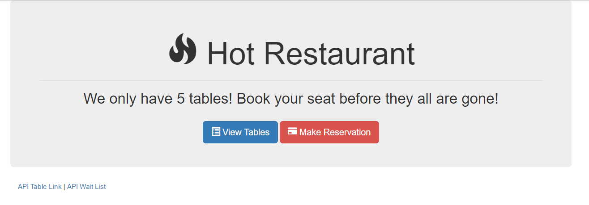
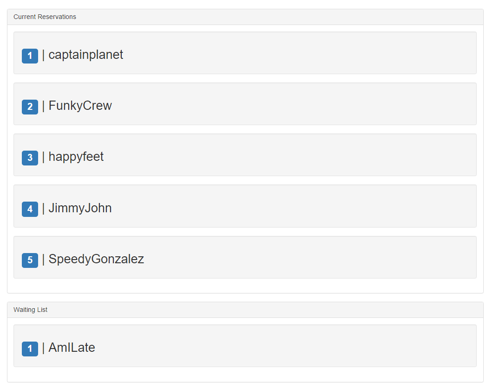
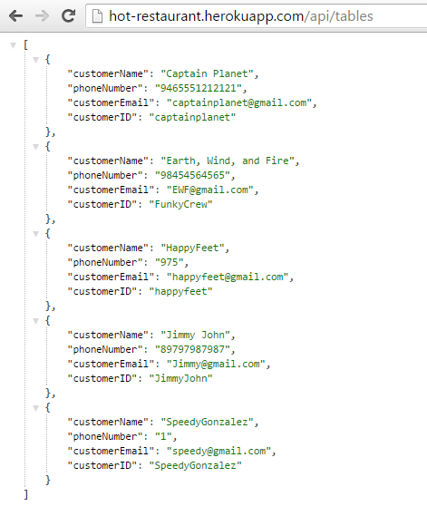
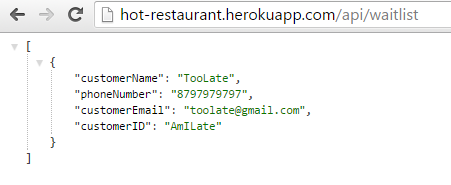

## 6.2 - Express Yourself (10:00 AM)

## Overview

Today's class is focused on creating an Express-based web server. Students will be introduced to the concepts of routing, request/response handling, and GET/POST requests.

## Instructor Notes

* `Summary: Complete activities 13-14 in Unit 11`

* Welcome back! Today's class is one of the most important in the program. You will be walking students through the creation of Node/Express-based APIs and their utilization by front-end interfaces.

* Give students a heads-up that today's class is **critical** and that we will be re-using the concepts throughout the remainder of the course. In fact, use your discretion to utilize an additional day of review the following week if warranted. This material is critical for students to succeed as developers. If necessary, you can cut a day from the end of the program to account for the review.

* A fairly generous amount of time has been left at the tail-end of the course to allow you to spend more flexibility today. Do not feel pressured to "rush" through the material.

* Be sure to slack out the [video walkthrough](https://youtu.be/ygk-kNstqK0) at the end of the activity! This will help students tremendously in understanding how to approach Express based application builds.

## Learning Objectives

* To gain a preliminary understanding of the basic elements of an Express server.

* To gain an initial understanding of Express routing.

* To build a complete Express-based web application.

## Slides

[6.2: Express Yourself](https://docs.google.com/presentation/d/1H1xhjeQyMGXW7fufs2GJe4j6twEvYpDNhhuZJNcuHEk/edit?usp=sharing)

## Time Tracker

[06.2 Time Tracker](https://docs.google.com/spreadsheets/d/1OqSsyFSCE1bBPxIoM5Ql2ak9iMCwXGP2/edit#gid=412217995)

- - -

## Class Instruction


### 1.	Instructor Do: Postman Demo (0:05)

* Have students articulate their answers before explaining to them that `express.json` and `express.urlEncoded` are modules built-in to express that allow Express to receive user posts (JSON, text, etc).

* Normally and data sent to the server isn't easily readable by humans, as it comes in as a low level stream.

* Explain that `express.json` and `express.urlEncoded` are examples of **middleware**.

  * Middleware is a function which we set to run between our server receiving a request and it being available inside of our routes.

  * Middleware can be defined using the `app.use` method.

  * Middleware can transform the request from the browser before we work with it. In the case of `express.json` and `express.urlEncoded`, it takes the unreadable request and turns it into a readable object and attaches it to `req.body`. By the time the request gets to our routes, our body parsing middleware has already formatted it for us.

* Then explain to them that in future applications we'll eventually be using jQuery's AJAX methods for sending such post requests to our server.

* Then have them install the program [Postman](https://www.getpostman.com/). We'll be using Postman so both windows users and mac users can be taught how to send POST requests using the same program. (Note: Students may ask questions like: "Do you always have to use postman to send post requests?" Use this as an opportunity to explain that Postman is simply a GUI for development, and that in future opportunities we'll be using jQuery or other front-end code approaches for sending the same post requests.)

* Walk students through the process of sending POST requests in Postman. If you are unfamiliar use the following points as a guide:

  1. Run your server instance.
  2. Open Postman.
  3. Select POST in the drop-down next to the link. Then enter the URL of your server's POST route.
  4. Click the button: "Body". Click the setting "Raw". Then hit the dropdown that says "Text" and click JSON.
  5. Enter in a complete JSON. You can use:
     ```json
     {
       "routeName": "darthvader",
       "name": "Darth Vader",
       "role": "Sith Lord",
       "age": 42,
       "forcePoints": 1900
     }
     ```
  6. Hit "Send"
  7. Now check back to your Star Wars API to confirm that Postman received the request body.
     

### 2.	Students Do: Postman Exercise (0:10)

* Now have students perform the same exercise with their own servers.

* You can slack out the following file and instructions:

* **File:**

  * `server5.js` (`12-StarWars-5`)

* **Instructions:**

  * Use Postman to send a POST request to the server you've been provided. Confirm that your character has been added to the database correctly.


### 3.	Instructor Do: Demo sendFile (server6.js + view.html)		(0:05)

* Open the file `server6.js` (`13-StarWars-6`). Look at the line under the `app.get('/')` route. Point out to students the use of the `res.sendFile` code. This code is used to send users a specific HTML file in response to their visiting a route.

  

* Be sure to point out how we make use of the built in `path` library to join relative and absolute file paths. In this case, we **could** just omit `path.join` pass `sendFile` relatives paths to the HTML files instead, but it's safer to provide absolute paths in case our Express app is ever started from a different directory. Normally this would be an issue, since absolute paths will almost always be different on different computers, as well as on Heroku. Thankfully we can make use of Node's built in `path` library. `path.join` is a function which accepts any number of String arguments, which are also expected to be file paths or partial file paths. `path.join` takes the passed in file paths, combines them into a new path, and returns it.

* The `__dirname` keyword is built into Node and available in every JavaScript file on the server. It's always equal to a the absolute path of the current directory. By passing `__dirname` as well as the relative path to the file we want to send into `path.join`, we'll get back an absolute path to the specified file.

### 4.	Students Do: Dissect .get view.html (0:10)

* **File:**

  * `server6.js` (`13-StarWars-6`)

* **Instructions:**

  * Look at the file sent to you then explain to the person next to you what the `res.sendFile` line does. Then try creating a new HTML file and routing to that one instead.

### 5.	Instructor Do: Review Activity (0:05)

* Review the previous exercise and answer any questions. Try to get students to think about the distinction between routing users to "data" and routing them to rendered "HTML" pages. Try to get them to think about when you would use `res.json` and when you would use `res.sendFile`.

### 6.	Instructor Do: Demo Complete Application (0:05)

* Open the completed application found in `14-FinalStarWarsApp`. Walk students through the overall folder structure and how there is a mix of the `server.js` file and the HTML files which will be relayed to users. Also point out how we have a new `add.html` file.

### 7.	Students Do: Dissect .post (add.html)		(0:10)

* Slack out a zipped copy of `14-FinalStarWarsApp`. Then task students with the following:

* **Instructions:**

  * Spend a few moments looking over the code sent to you. First, get the server running, then begin to dissect the JavaScript code found at the bottom of `add.html`.

  * Explain to one another what the code does, what its for, and why its relevant to the application so far. Be sure to explain to one another what the `$.post` code is doing.

### 8.	Instructor Do: Review Activity (add.html)	(0:05)

* Walk students through the meaning of the JavaScript in `add.html`. Go line by line and explain how jQuery is used to grab the values in the form -- then immediately POSTs these values to the API. The API then saves the records into the database.

* Answer any questions that remain. Then encourage students to look back at their class repository when completing the homework as there will be additional examples on folder structure relevant to their homework assignment.

* Finally, slack out a link to the [YouTube video walkthrough](https://youtu.be/ygk-kNstqK0?list=PLgJ8UgkiorCmI_wKKVt5FlkTG63sQF6rr) and encourage them to review at home. This will be a _huge_ help to students.

### 9. Instructor Do: Introduce Heroku (0:05)

* Local development is fun, but it's much more fun to deploy and share with others!

* Ask students what we've been using so far to deploy, and ask if anyone has any idea why that solution might not work now.
  * After students give suggestions, explain that GitHub Pages only hosts "static" pages, and doesn't support the server side of our application. 
  * Explain that GitHub Pages won't actually run any code for your app, it just hosts your HTML, CSS, JS, and other static files. It's similar to accessing your local files through your browser, only they're on a publicly accessible machine.

* That means we need something that will both host our files _and_ run our server-side code.

* Ask them if they can guess what we're going to use to host our full-stack application.
  * There are a ton of options, but specifically we're going to be using Heroku!

* Explain that Heroku is a platform as a service (PaaS). It allows deployment of a back-end and will start up and host your web server and server-side code for you!
  * Explain that the value here is similar to that of GitHub Pages, but for your whole app.
  * Heroku will manage your application and give it a public URL that anyone can access.

### 10. Students Do: Deploy to Heroku (0:30)

* Tell students that to wrap up today we're going to host that Star Wars app, so that even those in a galaxy far, far away can access it.

* Then have students login to their Heroku accounts online. Many of them will have forgotten their passwords, and may spend a significant portion of this activity getting set up.

* **File:**
  * `01-Activities/14-FinalStarWarsApp` (solution, zipped)
  * `03-Supplemental/HerokuGuide` (slacked out or link to class repo posted)

* **Instructions:**
  * Push the finished Star Wars app to heroku following the steps from the guide.

  * **BONUS:** Begin making the below additional page for your Star Wars app. Push those changes up as you build the new feature. Specifically, this will require:
    * Create a new page on your Star Wars website that displays a table of ALL characters in the database. This will involve at minimum:
      * Creating a route in the server.js file for displaying data
      * Creating a route in the server.js file for sending users a new HTML file
      * Creating an HTML file that grabs data from the server.

* Be sure to walk around and help students as they hit snags or have problems pushing to heroku, consulting the troubleshooting tips below as needed.

### 11. Review Unit 11 (30 mins)

* Spend some time answering lingering questions about the deployment process. If no questions remain, lead a review on Unit 11 so far.

- - -

### 12. Break (30 mins)

- - -

### 13. Instructor Do: Welcome (5 mins)

* Welcome students back to class. 

* Then when everyone gets settled give students a few moments to ask high-level questions regarding the previous class. 

* Let students know that the concepts covered this week regarding Node and Express servers are some of the most important concepts in the class. Let them know that it really gets to the heart of what full-stack web development is -- and for this reason, it's important they push themselves to learn it now.

* Slack out the below resources:

  * <https://scotch.io/tutorials/use-expressjs-to-get-url-and-post-parameters>

  * <https://scotch.io/tutorials/build-a-restful-api-using-node-and-express-4>

### 14. Instructor Do: Demo End Application (15 mins)

* Then begin to remind students that the best way to learn to code -- especially challenging concepts -- is sometimes just to force yourself to code. For this reason, today's class will be a 4-hour session in which you'll be building a real-world application that makes use of the concepts we're covering so far. 

* Slack out the following link: [hot-restaurant.herokuapp.com](http://hot-restaurant.herokuapp.com). 

  

* Then ask all students to make a Reservation request on the website. 

* Once they are done, visit the page: <http://hot-restaurant.herokuapp.com/tables>. Point out how their reservation requests have been captured and listed on the site. Depending on whether or not they were one of the first five requests, they were added to the reservation list -- otherwise they were put on the waitlist. 

  

* Then take a few moments to flip through the screens. Point out how there is a page for creating reservations, a page for viewing reservations, and two pages for viewing JSONs of the current reservations and waitlisted parties. 

  

  

* Let students know that they will be building this application from scratch over the course of the next few hours.
* Feel free to open up the `phases.md` file found in `15-HotRestaurant` folder and keep it on the screen during the development. Scroll down to the next phase when the time is up.

### 15. Instructor Do: Group Formation + Initial Instructions (10 mins)

* Have students divide themselves into groups of 4 (with 2 members from each section). 

* Then slack out the following instructions:

* **Instructions:**

  * Today you will be building a Node / Express based web applications for handling reservation requests. 

  * Your application will be made up of two parts: 1) A front-end set of HTML/CSS/JS pages for entering and viewing data and 2) A back-end composed of Node/Express and basic JS for storing, updating, and relaying reservation data.

  * Spend the time necessary to map this application out. Consider the concepts we've covered in class so far: 

    * Servers
    * Routing
    * APIs
    * AJAX (GET and POST Requests)

  * You should be referencing the code from the previous Star Wars application.

  * Feel encouraged to use the following application as a reference: <http://hot-restaurant.herokuapp.com/>

  * Note: We know this is a hard activity. We know you aren't yet comfortable with Node or Express. But push yourself. The best way to learn is to push through the discomfort and BUILD! Ask for help when you need it. We're here to help you through the process.

  * **Bonus:**

    * If by some miracle you finish early, feel encouraged to work on any one of these additional tasks to take your application to the next level.

      * Add code to your server so that it "counts" every time a person visits any of the pages. Display a running count on the website. 

      * Add buttons for "checking off" individuals from the reservation list. Once this happens, the next person on the waitlist should be addd to the main reservation list.

      * Add a button for sending emails to individuals on the wait-list letting them know they have a table ready. You will need to use node-mailer or a similar npm package to make this work. (A hard task, but very cool).

      * Add a button for sending text messages to individuals on the wait-list letting them know they have a table ready. You will need to use the Twilio library to make this work. (A hard task, but very cool). 

* Let them know that you will be providing them with guidance on how to proceed every 20 minutes or so. 

### 16. Partners Do: Phase I - Pseudocode (15 mins)

* For this first phase, slack out the following instructions:

* **Instructions:**

  * Phase I: For this first phase, aim to write out the pieces that will need to be programmed to create the functionality of your application. Try to break it into 6-7 pieces.

* **Instructors/TAs:** Once time is up have students share their breakdowns. As a suggestion, here is a list that you can slack them. 

  * Create the front-end (visuals) for home page, reservation form, and reservation views.

  * Create a basic server using Express.JS

  * Create a few array variables that will hold the data

  * Create a set of routes for getting and posting table data

  * Create a set of routes for displaying the HTML pages

  * Use jQuery to run AJAX calls to GET and POST data from users to the Express server

### 17. Partners Do: Phase II - Frontend + Server Creation (20 mins) (Critical)

* Proceed with the next phase. Slack out the following instructions to help guide them:

* **Instructions:**

  * Phase II: For this second phase, aim to complete the following:

    * Backend Team: 

      * Create a basic Express server. 

      * Your server at this point should do the BARE MINIMUM. (Effectively, it should just say: "Listening at PORT 3000" when the command `node server.js` is run.)

    * Frontend Team:

      * Create three HTML files one called `home.html`, another called `tables.html`, and another called `reserve.html`. Use dummy data and create pages similar to the one shown to you on the sample Hot Reservation webpage.

    * All: If you finish early, begin thinking about how the Data, API, and Routes should look.

* **Instructors/TAs:**

  * Have students who accomplished this task share their code with you (via GitHub) and display it on screen. Then have them come up and talk about what they did. 

### 18. Partners Do: Phase III - API Routing + Frontend Delivery (40 mins) (Critical)

* Proceed with the next phase. Slack out the following instructions to help guide them:

  * Phase III: For this third phase, aim to complete the following:

    * Backend Team: 

      * Create a set of variables (hint: arrays of objects) for holding the reservation and waitlist data 

      * Create a set of routes that then display this data as JSONs. Users should be given these JSONs if they visit the appropriate page (i.e. if a user visits `localhost:3000/api/tables` they should see a JSON of table data).

    * Frontend Team:

      * Temporarily join the backend team. Your task will be to create Express routes that display your HTML pages when a user visits the appropriate page. (i.e. if a user visits `localhost:3000/tables`... they should be shown the `table.html` page.) 

      * If you finish early begin creating the code necessary to convert your form data into JSON objects. 


### 19. Partners Do: Begin Phase IV - Backend Logic + AJAX (15 mins)

* Proceed with the next phase. Slack out the following instructions to help guide them:

  * Phase IV: For this fourth phase, aim to complete the following:

    * Backend Team: 

      * Create the logic that handles reservation requests. Your code should work such that POST requests take in JSON objects, checks if there is any space left, then adds the JSON object to either the reservation array or the waitlist array. Your POST route should also respond to requests with a confirmation (true or false) of whether or not the requestor has a reservation (or is on the waiting list).

      * You should be using Postman to do all your testing at this point.

    * Frontend Team:

      * Begin to do serious research on AJAX. Specifically, focus your attention on how AJAX can be used to do both GET and POST requests. 

      * Then create the necessary code on your `tables.html` page such that it can retrieve data from the Backend Team's API. In essence you will be creating an AJAX GET request to retrieve the data.

      * Then create the necessary code on your `reserve.html` page such that it can send data to the Backend Team's API. In essence you will be creating an AJAX POST request to send the data. 

    * All: This is the most challenging part of today's activity. Be persistent! You can do this!

- - -

### End

### MySQL Install

* We will be coming up on MySQL next class. Let student's know to install MySQL Server and Workbench. Guides have been provided so slack these out to students:

  * [MySQL Install Mac](../../12-Week/01-Day/Install_Guides/mysql-mac-guide.md)
  * [MySQL Install Windows](../../12-Week/01-Day/Install_Guides/mysql-windows-guide.md)

* If your class runs into trouble with this install process, feel free to use MAMP or any other installation solution that you would prefer to get the class ready.

### Troubleshooting Guide

* **Forgetting to git "add -A, git commit -m":** Often students will completely skip the step where they save and commit their changes prior to pushing to GitHub. This will mean their web page is essentially blank. As a starting point, ensure their code is present in GitHub before tinkering with Heroku issues. If they have no code in GitHub, they certainly have no code in Heroku

* **Images and/or CSS not appearing:** All filenames and paths are case sensitive. Ensure that all links in HTML are using case-sensitive paths that match the folder directories casing.

* **Not using relative paths:** Students using absolute paths to reference their CSS, JS, or image files. Help them to convert these to relative paths. 

* **Not knowing where their site deployed:** Show students that they need to login to the site and they will see the new app deployed on their menu. Then help them go to Settings and scroll until you see the "Heroku Domain".

* **Heroku Login not working on Windows:** For first time Windows Users, you need to use `cmd.exe` to login to Heroku. If you do not do this, bash will likely prevent you from logging in  and you will be unable to proceed with Heroku Steps.

* **More than five Heroku apps:** As students progress in the course, they will have many more Heroku apps. Once you get to five apps, Heroku requires users to authenticate their identity with a credit card. This credit card won't be charged, but its a requirement to have more than five active apps.

* **Not using environment variable for port:** Help students update their app so that they are getting the port the app is listening on from `process.env.PORT`.

* **Not having start script in `package.json`:** Help students update their app so that they have a start script in the `scripts` block of their `package.json` file, and ensure that they can run `npm start` to start up their server.

* **Not having production dependencies in `package.json`:** Ensure that any required packages are listed in the `dependencies` block in the `package.json` file.

#### Resources

* [Getting Started on Heroku with Node.js](https://devcenter.heroku.com/articles/getting-started-with-nodejs#introduction)
* [Deploying Node.js Apps on Heroku](https://devcenter.heroku.com/articles/deploying-nodejs)
* [Scotch.io Heroku Node Tutorial](https://scotch.io/tutorials/how-to-deploy-a-node-js-app-to-heroku)

### Lesson Plan Feedback

How did today’s lesson go? Your feedback is important. Please take 5 minutes to complete this anonymous survey.

[Class Survey](https://forms.gle/nYLbt6NZUNJMJ1h38)