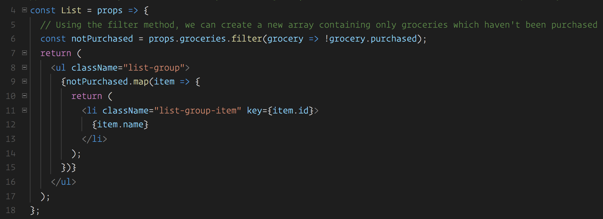
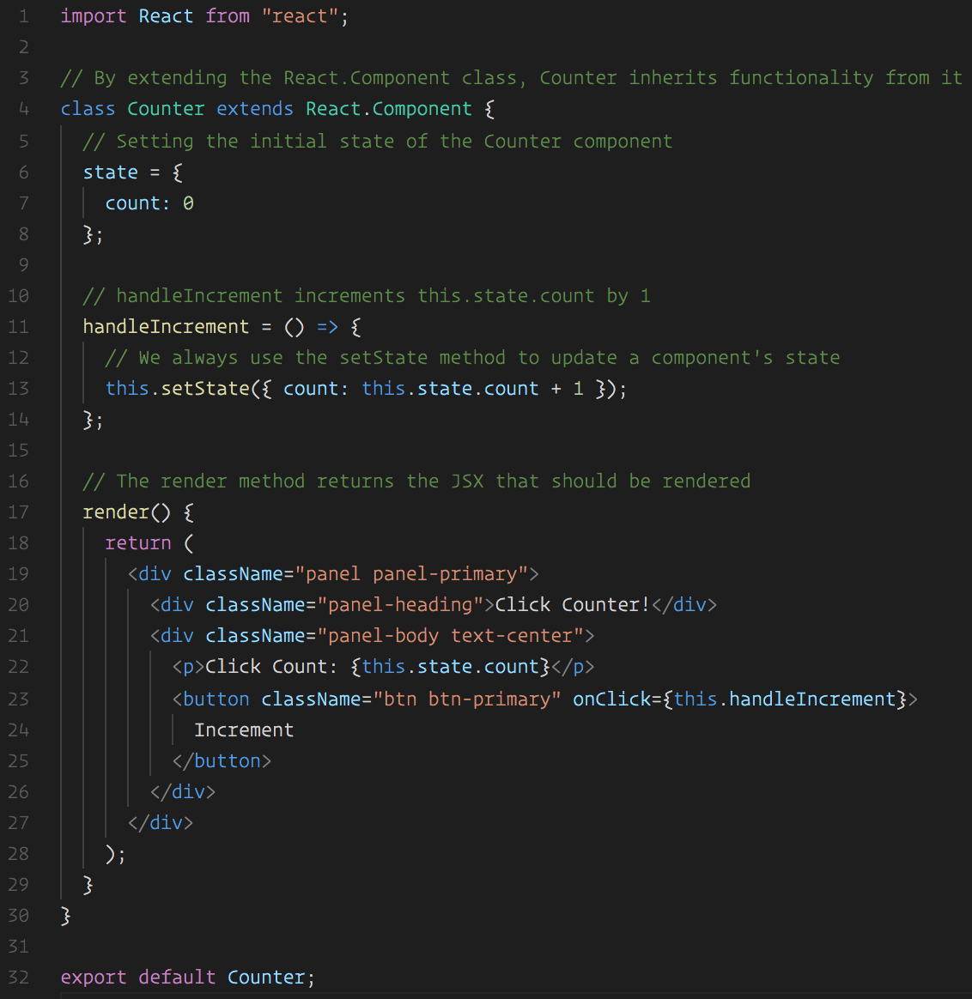
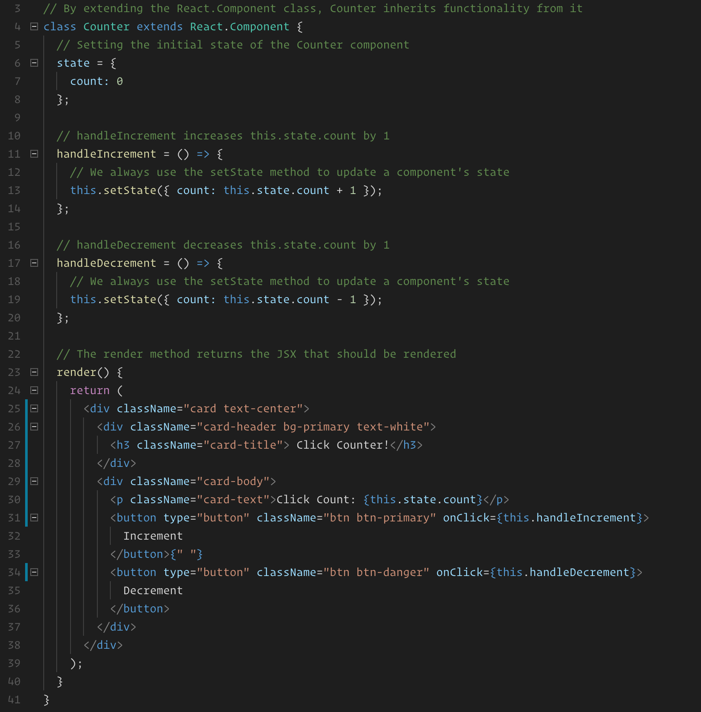
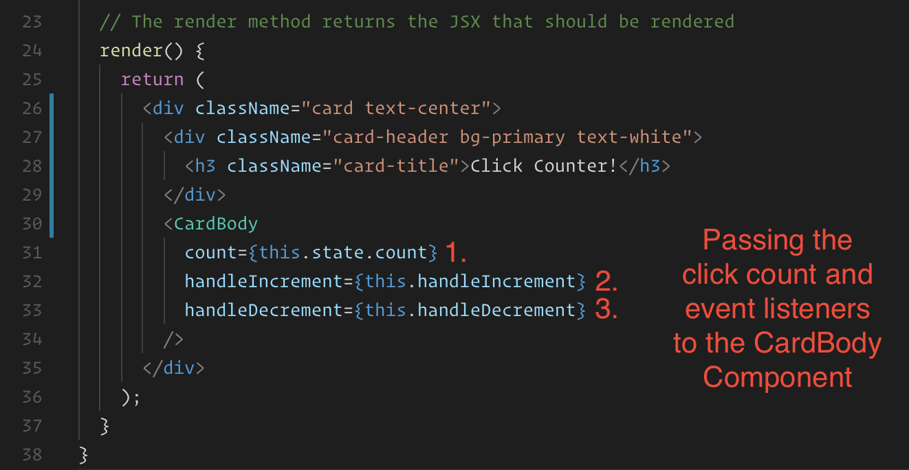
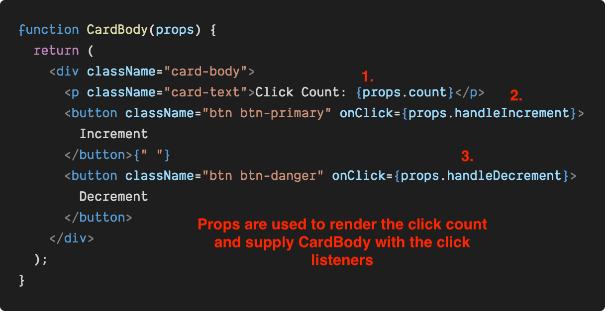
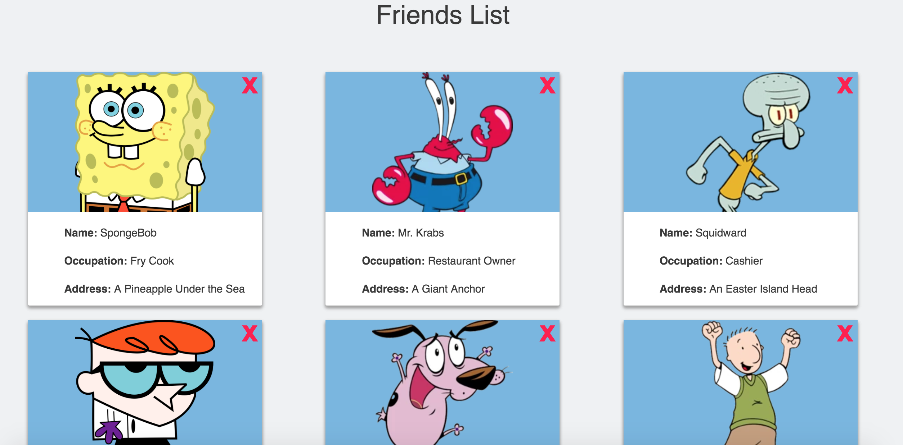
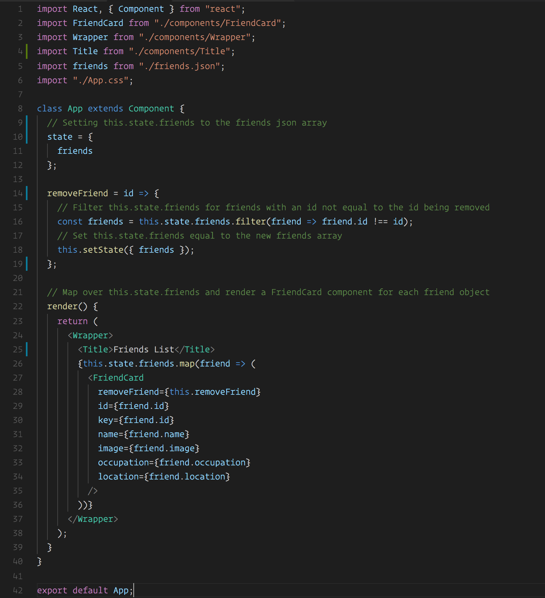
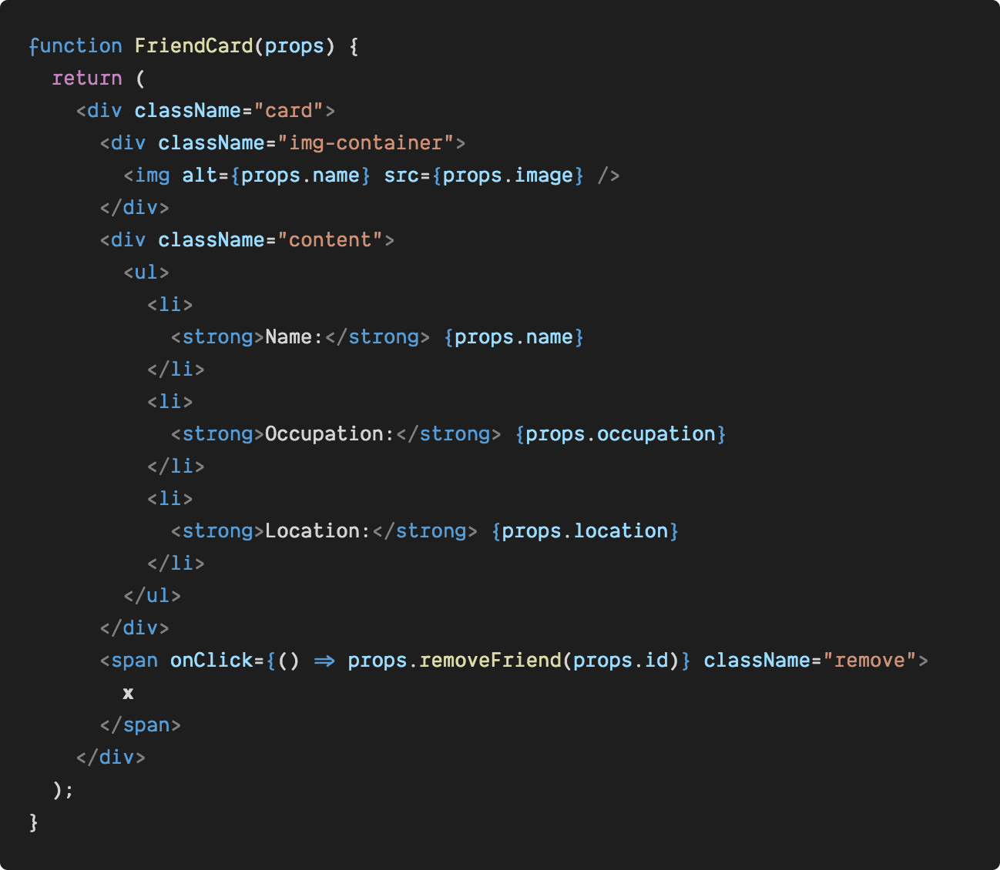
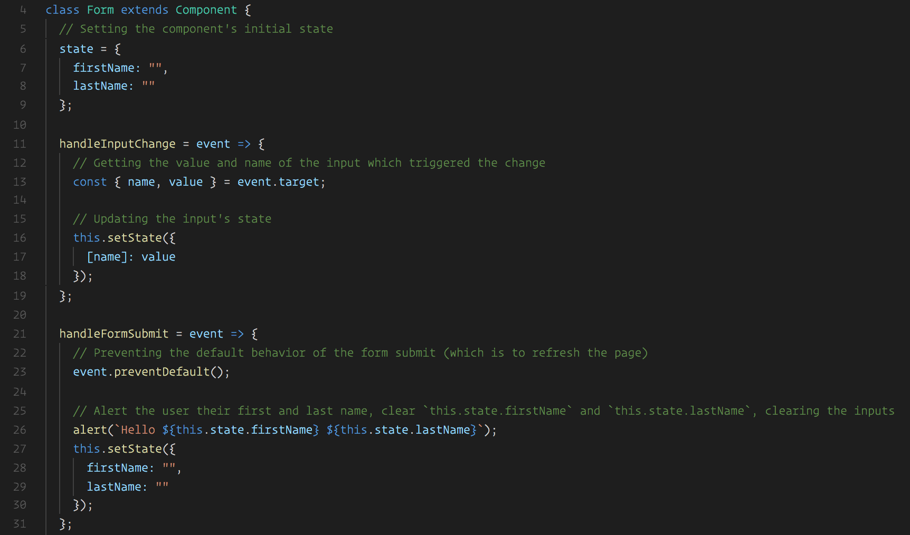

## 10.2 - Intro to React, Components and JSX (10:00 AM) <!--links--> &nbsp; [⬅️](../01-Day/01-Day-LessonPlan.md) &nbsp; [➡️](../03-Day/03-Day-LessonPlan.md)

## Overview

In this class, we will be introducing students to the basic concepts of ReactJS, JSX, and building layouts through a component-based mindset.

We will then be deepening students understanding of ReactJS. They further expand upon their understanding of props, learn how to programmatically render components from a list of data, and introduce the concept of class components and component state.


## Instructor Notes

* `Summary: Complete activities 19-react/01-Activities/13-Stu_ComponentMap through 20-state/01-Activities/21-Stu_ConditionalRender`.

* It is recommended that you arrange for students to globally install both Create React App before today's class.

* **Important:** In order to avoid continuous NPM installs, all of today's activity Solved and Unsolved versions include only a `src` folder. Students and yourself should scaffold out a React app once with Create React App, and then swap out the `src` folder for each activity.

* Today's class will be more challenging than the last class for many students. Syntax errors will abound as students confusedly mix states and props, and forget to pass attributes to their child components. Explain that memorizing syntax will come with time and practice, it's far more important to understand the concepts covered as exact syntax can always be looked up.

## Learning Objectives

* Build forms with React.

* Pass props between React components.

* Programmatically render components from an array of data.

* Differentiate between class components and functional components.

* Conditionally render components.

## Time Tracker

[10.2 Time Tracker](https://docs.google.com/spreadsheets/d/1NpQ3y8IoBqP3Uuq9Wv2RwxK3HXdx8tp8TudcoJLBDh4/edit?usp=sharing)

- - -

### 1. Students Do: Component Map (10 mins) (Critical)

* In this activity, students will utilize the map method in order to render JSX from an array of objects.

* **Instructions:** [README.md](../../../../01-Class-Content/19-react/01-Activities/13-Stu_ComponentMap)

* Instructional staff should be walking around the room making themselves available for assistance.

### 2. Instructor Do: Review Component Map (10 mins)

* Slack out the [solutions](../../../../01-Class-Content/19-react/01-Activities/13-Stu_ComponentMap/Solved) to the previous activity and go over the code as a class.

* For the basic solution:

  

  * Point out how the array of grocery objects is passed into the `List` component from inside of `App`, making it available inside of the `List` component as `props.groceries`.

  * Inside of the `List` component, we insert JSX curly braces inside of the `ul` element. We map over `props.groceries` and return one `li` tag for every element in `props.groceries`.

  * Ask the class: What type of value is returned by the map method here?

    * Explain that the map method will always return an array &mdash; in this example it's returning an array of JSX elements.

    * React is smart enough to know what whenever we're rendering an array containing JSX, it should deconstruct the array and render each element inside of their parent.

  * Point out the `key` property attached to the `li` tag inside of the map. Ask the class: Was anyone able to read about what this is for?

    * The application will still run if we were to remove the `key` prop, but we'd get a very specific warning telling us we should include it.

    * Whenever an array of JSX is being rendered, React expects each rendered parent JSX tag to have a unique `key` prop. This is a special type of prop that helps React efficiently re-render the list of JSX if it should ever need to change.

      * The `key` prop should be unique and specific to the data being rendered. Often this comes in the form of an `id` from a database. But it can be anything we can guarantee to be unique.

      * Using the index of the element in the array is not a good idea, since an element's index could change if the data we modified. This could potentially cause strange bugs.

  * Assure the class they don't need to stress out too much about the `key` prop since they'll get a very specific warning about it should they forget to include it and their code will still work.

  * The most important takeaway from this activity is that we can use the map method to loop over an array and return a new array of elements inside of JSX curly braces. React will then render each element in the resulting array.

  * Take a moment to answer any additional questions.

* For the bonus solution:

  

  * Demonstrate how we can create a `notPurchased` array by filtering `props.groceries` for groceries which have a `purchased` property set to false.

  * Remind everyone that while the map method returns a new array the same length as the original, the filter method returns a new array containing only the elements whose callback functions return truthy values.

  * Explain that we still need to use the map method to actually render the `li` elements. But we first filter for groceries which haven't been purchased, and then map over the new array, rather than `props.groceries`.

* Answer any questions before the break.

### 3. Instructor Do: Introduce Stateful Components (20 mins)

* Explain to the class that what we've been working with so far are known as stateless, functional components. Sometimes called "dumb components".

* These components can render JSX, receive props, and embed JavaScript expressions inside of themselves.

* In a React application, **most** components should be stateless components. These are easy to test, debug, and they tend to be more reusable &mdash; even across applications &mdash; because they usually don't depend on how the rest of the application works.

* So far we've been using stateless components to create static, unchanging UIs. In a real application, we'd want to give some of our components more complex dynamic behaviors.

* Now we're going to introduce stateful components. These special components aren't created using plain JavaScript functions, but with ES6 classes (which, if we want to get technical, are still JavaScript constructor functions once compiled).

* Explain that `state` is a special type of property attached to a class component that can contain data we want to associate with that component.

* Explain that values stored on a component's state are different from regular variables because unlike regular variables, when a component updates its `state` the React application will update itself in the browser to reflect the change wherever necessary.

  * Explain that a component can set and update its own state, whereas its props are always received from up above and considered immutable (can't/shouldn't be changed).

* Replace your Create React App's `src` folder with [14-Ins_BasicState](../../../../01-Class-Content/19-react/01-Activities/14-Ins_BasicState/src). Stop the dev server if it is already running. Start the app in dev mode by running `npm start`.

* Open your browser to [localhost:3000](http://localhost:3000) and demonstrate the rendered app.

  

* Whenever we click the "Increment" button, the click counter goes up by 1. Point out that this is the first time we've built in any kind of dynamic behavior such as event listeners and UI updates into our React apps.

* Open `src/components/Counter.js` in your editor, walk the class through the code:

  

  * We create a new class named `Counter` which _extends_ the `React.Component` class.

    * Explain that `React.Component` is a class built-in to React which has special features we don't get with stateless functional components. By extending the `React.Component` class, `Counter` now inherits this extra functionality.

  * Then we set a `state` property on the component. We set its value to an object with a `count` property set to `0`. This is the initial counter value displayed when the component first loads.

    * Our component's `state` property must always be set to an object.

    * Because this component contains its own state, we call this a **stateful component**.

    * Create React App allows us to use [ES7 property initializer](https://babeljs.io/docs/plugins/transform-class-properties/) syntax. This allows us to attach properties to the class instance without writing out a constructor method.

  * Scroll down to the `render` method. Explain to the class that this method is built-in to React, and as the name implies, its job is to return the JSX that the component should render. Every class component needs to have this method defined.

  * Scroll down further to the "Increment" button and point out how the button has an `onClick` prop set to `this.handleIncrement`.

    * Explain that this is how a click event listener is defined in React. When the button is clicked, this component's `handleIncrement` method is called.

    * Explain that event names in React are similar to vanilla JavaScript or jQuery, e.g. `onClick`, `onSubmit`, `onChange`, etc.

  * Scroll back up to the `handleIncrement` method definition. Point out that unlike `render`, this method is using arrow function syntax.

    * Due to the nature of how props are passed to React elements, `this` inside of any method passed as a prop will be `undefined`, rather than the intended component. This is a common source of frustration and bugs for developers new to React. But thanks to the new class property initializer syntax, we can simply write all of our custom methods using arrow functions and never have to worry about this issue.

  * Point out how inside of `handleIncrement` we're calling `this.setState` and passing in an object as an argument.

  * Explain that `setState` is built-in to all class components. We use this method to update our component's `state` by passing it an object containing parts of the component's state we want to update and their new values.

    * Explain that whenever we want to update our component's state, we **ALWAYS** use `this.setState` to do so. Updating our state with this method tells our component that it should re-render itself and all of its children to account for the new state.

    * Explain that if we just updated `this.state.count` directly without using `setState`, we'd never see the click count go up in the view since there'd be no re-render.

      * Example:

      ```js
      // This wouldn't work as expected
      this.state.count = this.state.count + 1;
      ```

* Take a moment to answer any high-level questions the class may have. Most importantly make sure they understand the following:

  * We can use `state` to associate data with our components and keep track of any values we want to update the UI when changed.

  * We can define methods on a class component and pass them as props.

  * The `onClick` prop can be used to set a click event listener to an element.

### 4. Partners Do: Decrement Counter (10 mins)

* Slack out `15-Stu_DecrementCounter/Unsolved`

* In this activity students will add a "Decrement" button and event handler to the previous Click Counter example.

* **Instructions:** [README.md](../../../../01-Class-Content/19-react/01-Activities/15-Stu_DecrementCounter/README.md)

### 5. Instructor Do: Review Decrement Counter (10 mins) (High)

* Slack out the [solved](../../../../01-Class-Content/19-react/01-Activities/15-Stu_DecrementCounter/Solved) versions of the previous activity and go over both solutions.

  

* First go over the code in the basic solution:

  

  * Point out how we've defined a `handleDecrement` method which decreases the counter by 1.

  * Explain that like all event handlers, `onClick` expects a callback, which is why we write `onClick={this.handleDecrement}` instead of `onClick={this.handleDecrement()}`.

* Then go over the bonus solution:

  * 

  * Point out that we've replaced the `.card-body` div with a `CardBody` component which renders its contents.

  * We pass the click count and the event listeners to the `CardBody` component.

* Demonstrate the code inside of the `CardBody` component:

  * 

  * This component renders the same JSX that was removed from the `Counter` component. The only difference is that we're accessing the click counter and event handlers on the props argument.

  * Explain that even though the buttons are inside of a child component, the `Counter` component's `count` state is still updated when the buttons are clicked.

  * When the `count` state is updated, The `Counter` component and any of its child components re-render themselves. This is what allows the view to be updated in the browser when the buttons are clicked.

  * Explain that even though data still technically only flows one way (from the top-down) in React, we can allow child components to update their parent's state by passing them a method created in the parent.

* Assure the class that they'll get more practice with working with class components.

* Take a moment to answer any additional questions.

### 6. Students Do: Friend Refactor (20 mins) (Critical)

* Slack out `29-Stu_FriendRefactor/Unsolved`

* In this activity students will further refactor the Friends List application from earlier to use class components, events, and programmatically render the `FriendCard` components.

* **Instructions:** [README.md](../../../../01-Class-Content/19-react/01-Activities/16-Stu_FriendRefactor/README.md)

### 7. Instructor Do: Review Friend Refactor (15 mins)

* Go over the [solution](../../../../01-Class-Content/19-react/01-Activities/16-Stu_FriendRefactor/Solved) to the previous activity.

* Demonstrate the completed application in the browser. Point out how we can remove friends by clicking the red x icon.

  

* Briefly go over the syntax for writing a class component. Be sure to point out the constructor method, how we set the application's initial state. Explain that when defining object properties with ES6, if the object's key and value have the same name, we can omit the colon &mdash; this is just an optional shorthand syntax.

* Point out how we bind the `removeFriend` method inside of the constructor. Ask the class: how does this method remove a friend?

* Point out how inside of the `removeFriend` method we use the filter method to create a new `friends` array from `this.state.friends`. We include only friends with an `id` property **not** equal to the `id` being received into this method. Then we use the `setState` method in order to set `this.state.friends` equal to the new filtered friends array.

  

* Explain that when we update our component's state by removing one of the friend objects, our component re-renders itself. On the new render, `FriendCard` components are created for each object in `this.state.friends`, which no longer includes the deleted friend. This then triggers our component to re-render, now minus one friend.

  * Remind students that in React, we never modify state directly, but we create new state instead. If the state we're modifying is an array, we'll often use the filter or map method.

* Scroll down to the code where we map over `this.state.friends` and render a `FriendCard` component for each element.

  * Point out the props being passed, in particular, the `id` and the `key` prop. Remind the class that whenever we map over a list of data and return JSX, React wants us to give each element a unique `key` prop. React uses this value internally to help it efficiently render and re-render components from arrays of data.

    * Explain that the `key` prop is unusual because it's used by React but isn't actually available for us to use inside of the component we pass it to. We pass the friend `id` in as a separate prop because we'll need it inside of the `FriendCard` component.

* Open up the `FriendCard` component.

  

* Point out how we've attached the `onClick` handler to the "remove" span. When clicked, it calls the `removeFriend` method and passes in `props.id`.

* Ask the class: Why do we have the `removeFriend` handler wrapped inside of another function?

  * Explain that since our event handlers need to be callbacks, we normally can't pass in arguments without invoking them right away. But by wrapping the `removeFriend` method in an another function, we can pass the `id` prop into the inner `removeFriend` method. When the span is clicked, it calls the anonymous callback function, which then calls the `removeFriend` method with the friend's `id` as an argument.

* Take a moment to answer any lingering questions.

### 8. Instructor Do: Demonstrate Forms (15 mins)

In this example we will demonstrate how to handle simple forms with React.

* Swap out your application's `src` folder with [src](../../../../01-Class-Content/19-react/01-Activities/17-Ins_FormsDemo/src). Stop the dev server if it is already running. Start the app in dev mode by running `npm start`.

* Open [localhost:3000](http://localhost:3000) in your web browser and demonstrate the rendered application.

  * 

  * Whenever we type into the input fields we see the input appended to the "Hello" statement.

  * When we click the "Submit" button, we get an alert with the provided first and last name.

    

* Now open `src/Form.js` and demonstrate the underlying code. It may be easier to begin with this component's `render` method.

  

  * Point out the following props attached to the `input` elements:

    * `value`: set to `this.state.firstName` or `this.state.lastName`

    * `name`: set to `firstName` or `lastName`

    * `onChange`: both set to `this.handleInputChange`

* Then go up to the component's `constructor` method. Point out how `this.state.firstName` and `this.state.lastName` are both initially set to an empty string.

  * To make sure everyone is following along so far, ask the class: Where is this state object coming from? Why do we use it?

    * A component's "state" is a property defined on a class component instance used for storing values that we want to associate with it. This property is recognized by React and can be used to embed data inside a component's UI which we want to update over time. Whenever a component's state is updated, its `render` method is fired along with the `render` methods of all of its children. This updates the application's UI to display the new data without having to refresh the browser.

* Then scroll back down to the `render` method and point out how each input has a `value` prop set to the value of one of these state properties.

  

* Ask the class: What would happen if I pre-set the first and last name states to values other than empty strings?

  * The text inside of each input field is determined by their `value` prop. By changing this component's initial state, we're also changing the initial values of the input fields. Demonstrate this live for the class.

* Then scroll down to the `handleInputChange` method. Ask the class: What do you think this method's job is?

  * This method is responsible for updating our state as the user types into the input fields.

* Then ask: What do you think would happen if I removed the `onChange` props from the input fields?

  * Proceed to remove the `onChange` props from both input elements. You should now be unable to type any new characters into the input fields after doing to.

  * Explain that `onChange`, like `onClick` or `onSubmit`, is a built-in event we can listen for by attaching a prop to a primitive JSX tag (a JSX tag that represents a basic HTML element).

  * Explain that by removing the `onChange` prop, we are no longer responding to the input's "change" event and thus are no longer updating our `Form` component's state. The `value` prop on each input field continues to point to the same unchanging state value.

  * Explain that if we were to also remove the `value` prop from an input field altogether, then we could update it, but it wouldn't update our state and we wouldn't have access to its value if we needed it. Explain that we use the `value` and `onChange` props on the input element to sync its value with our components state.

* Go back to the `handleInputChange` method and walk through its logic.

  * `handleInputChange`, like all event handlers, is passed an `event` object that describes the event that took place. We pull off the `name` and `value` properties from the `event.target` object. These correspond to the `name` and `value` properties attached to the element the event was triggered from.

    * Since each input field has a `name` prop set to the name of the state property holding its value, we can run the following code to update the appropriate state:

      ```js
      this.setState({
        [name]: value
      });
      ```

    * Starting with ECMAScript 2015, the object initializer syntax also supports computed property names. That allows you to put an expression in brackets [], that will be computed and used as the property name. Refer to the [MDN documentation](https://developer.mozilla.org/en-US/docs/Web/JavaScript/Reference/Operators/Object_initializer#Computed_property_names).

    * If students have questions regarding this syntax, demonstrate the same approach in ES5:

      ```js
      const newState = {};
      newState[name] = value;
      this.setState(newState);
      ```

* Scroll down to the `handleFormSubmit` method. Ask the class: Why are we running `event.preventDefault()`?

  * The default behavior of an HTML form submission, is to refresh the entire web page. We want to prevent the form's default behavior in lieu of our own. Remind the class that we also had to deal with this back when working with jQuery.

* Be sure to point out the code where we throw an alert with the user's first and last name before resetting our `firstName` and `lastName` state to empty strings to clear our input fields. Take a moment to make sure everyone understands how the string template literal syntax is working.

  * String template literals can be used to write multi-line strings and embed expressions without breaking the string. Instead we'd use the ${<expression>} token to embed expressions inside of our string.

* Take another few minutes to make sure everyone understands the code at least well enough to be able to refer back to this example as a starting point as they're building their own React forms.

### 9. Students Do: Fun With Forms (15 mins)

* In this activity students will add some new functionality to the previous form example.

* **Instructions:** [README](../../../../01-Class-Content/19-react/01-Activities/18-Stu_FunWithForms/README.md)

### 10. Everyone Do: Break (30 mins)

### 11. Instructor Do: Review Fun With Forms (10 mins)

### 12. Instructor Do: AJAX Demo (15 mins)

In this example we will demonstrate AJAX requests with React.

* Replace your application's `src` folder with [19-Ins_AJAX/src](../../../../01-Class-Content/20-state/01-Activities/19-Ins_AJAX/src). Paste the Bootstrap CDN into `public/index.html`. You may use the snippet provided below:

  ```html
  <link rel="stylesheet" href="https://cdnjs.cloudflare.com/ajax/libs/twitter-bootstrap/4.0.0/css/bootstrap.min.css"/>
  ```

* Install the `axios` library by running the following command:

   ```
   npm install axios
   ```

* Stop the dev server if it is already running. Start the app in dev mode by running `npm start`.

* Navigate to [localhost:3000](http://localhost:3000) and demonstrate the application's functionality.

  

  * This app searches the Giphy API for whatever is typed into the input field and then displays the results below.

  * When we first load the app, we should see kitten related results.

* Open the `src/components` folder and point out the three files inside:

  * `ResultList.js`

  * `SearchForm.js`

  * `SearchResultContainer.js`

* Explain to the class that `SearchResultContainer` contains and renders the `ResultList` and `SearchForm` components. This is our application's only stateful component.

* Briefly demonstrate this without digging into each component's exact functionality in your editor just yet.

  

* Ask the class: Why do you think `SearchResultContainer` is a stateful component, but `SearchForm` and `ResultList` aren't?

  * It's possible to make every component in our React application stateful. But it's usually cleaner and less error prone to have some kind of parent component which contains all of the data and functionality its children will need, and then pass those down as props.

  * Quick aside: Slack out this [article written by Dan Abramov](https://medium.com/@dan_abramov/smart-and-dumb-components-7ca2f9a7c7d0) (Redux Author, React Core Contributor, Create React App Core Contributor) for students to read through on their own time. He describes the pattern of separating components into "container" and "presentational" components. In a nutshell, this can be explained as follows:

    * Container components are primarily concerned with how things _work_ and render very little, if any of their own markup. Instead they mostly render other components and pass down the logic and data they need to work.

    * Presentational components are concerned with how things _look_ and typically don't contain any logic that doesn't have to do with their own individual UI.

    * This pattern helps us build components with little to no coupling that can more easily be reused in different parts of app or even across applications. It also lets us stub out our applications appearance by writing presentational components first, and then writing container components once we're ready to make things work.

  * This isn't important for students to totally understand now, but slack out the article for them to check out later. The most important takeaway should be that there should be a few of these "container" components which act as the "brain" for their children. In our case this is `SearchResultContainer`.

* Now, open `src/components/SearchResultContainer.js` and walk through the code.

  * Our initial state has a `search` property set to an empty string and a `results` property set to an empty array.

    

  * We have a new unfamiliar method defined called `componentDidMount`. Explain that like the `render` method, this method is built-in to React and automatically run **after the component is rendered for the first time.**

    

  * Inside of this method we run the `searchGiphy` method and pass in "kittens" as an argument. Before getting into how exactly the `searchGiphy` method works, explain that this code searches the Giphy API and updates our application's `result` state using the results from the AJAX request. By writing this code inside of the `componentDidMount` method, we're saying we want it to run after the initial component render, before state updates take place.

  * Explain that when working with class components in React, we are able to hook into to a few different **component lifecycle events**, that allow us to automatically execute logic at certain times.

    * Explain that these component lifecycle events are similar to some of the DOM lifecycle events we've worked with in vanilla JavaScript or jQuery. For example, in jQuery, `$(document).ready` runs when the entire web page is loaded.

    * In React, `componentDidMount` runs after a component and all of its children have been initially rendered and mounted to the DOM, and have no further expected initialization steps.

    * Explain that there are a few different React component lifecycle events we can hook into but `componentDidMount` is probably the one we'll use most frequently as this is the best place to run any async code we need to populate our component's state after the component mounts.

    * Ask the class: Why wouldn't we just run our `searchGiphy` method inside of our component's constructor and populate our initial state there? That is, assuming we went back to explicitly using the constructor method.

      * Constructor functions run synchronously and AJAX requests are asynchronous. So we might not have the async data available by the time the component is instantiated.

      * Additionally, running our async code inside of the constructor could cause extra re-renders of our component &mdash; making our application feel slow or glitchy on startup &mdash or introduce difficult to track down bugs.

      * By the time `componentDidMount` is run, there's no more work for our component needs to do. Even if the AJAX request fails or takes a long time to complete, we'd still have our component and its children rendered to some degree.

      * Explain that `componentDidMount` is called automatically once per component instance.

      * Explain that, technically, `render` is another component lifecycle event, but rather than only running once, the `render` method is called every time our component's state is updated or anytime our component receives new props.

      * Slack out this [article on the React component lifecycle](https://engineering.musefind.com/react-lifecycle-methods-how-and-when-to-use-them-2111a1b692b1) for students to read on their own time.

  * Go to the `searchGiphy` method and ask the class: What do you think this method is doing? Without even knowing what this `API` object is, what does it look like this method is doing?

    * This method is searching the Giphy API, passing in `this.state.search` as a query. It's then setting `this.state.results` to the JSON array that comes back from the AJAX request.

  * Open `src/utils/API.js` and go through the code inside of our API helper.

     

    * This file exports an object with a `search` method. Go back to the `SearchResultContainer` and point out how this `search` method corresponds to `API.search`.

    * This `search` method accepts a `query` parameter and returns the following:

      ```js
      axios.get(BASEURL + query + APIKEY);
      ```

    * Explain that axios is a third party library we've installed for the purpose of making AJAX requests. React itself doesn't ship with any functionality for making AJAX requests. Instead we can use whatever library we'd like for this.

    * Axios functions _very_ similarly to `$.ajax` in jQuery.

    * By running `axios.get`, we're saying we want to perform a GET request.

    * At the very least, the `axios.get` method requires one argument: the url we want to send the request to. We construct the full Giphy API URL using the `BASEURL`, `query`, and `APIKEY` strings. This should remind students of a few weeks ago when we initially worked with the Giphy API using jQuery.

    * Explain that like `$.ajax`, all of axios's methods return a promise object. By returning this method call, we can deal with what happens _after_ the request in our code which imports this module. i.e. point out how we run the `.then` and `.catch` inside of `SearchResultContainer`.

  * Explain that there are other libraries available for making AJAX requests. We even have a `fetch` method built into modern browsers which is similar, but tends to require more configuration to perform simple requests. We could have even imported jQuery and used `$.ajax` if we wanted to. But it's a better idea to use a smaller, single purpose library for making our AJAX requests.

  * Explain that by writing our logic for performing AJAX requests inside of this `API.js` helper file, we no longer need to care about how exactly the AJAX request is implemented in our components. We'd simply require the file and declaratively make a request using a minimum amount of information instead.

  * Go back to the `searchGiphy` method inside of the `SearchResultContainer` component and briefly go over its code once more now that we've explained the `API` object.

    

  * Point out that the `handleInputChange` method should look familiar to the previous examples, but re-explain how it works if necessary. Demonstrate how we pass this method to the `SearchForm` component as a prop and set the `onChange` prop of its input field to this method.

  * Inside of the `SearchResultContainer`, the `handleFormSubmit` method is a _little_ different compared to the previous example. Point out how when the form is submitted, we first prevent its default behavior with `event.preventDefault()`. Then we call `this.searchGiphy` which searches the Giphy API for the value of `this.state.search`.

  * Finally, open the `ResultList` component and demonstrate how this component renders a list of images it receives on its `results` prop.

* Take another few minutes to explain any parts of this code which may still not be entirely clear. The major takeaways for this example should be:

  * Most of our application's components should be stateless components primarily concerned with some part of our application's presentation.

  * A smaller number of components should be stateful class components which contain part of our application's business logic and state. Generally these "container" components render our stateless "presentational" components and pass down data and functionality on a need to know basis.

  * `componentDidMount` is a component lifecycle event. This event is triggered once after the component has initially rendered for the first time. This is the best place to perform any initial AJAX requests. There are a few others lifecycle events available, but `componentDidMount` is the one they'll probably end up using the most frequently.

  * We're using the `axios` library to perform our AJAX requests. React itself is primarily concerned with our application's view layer and doesn't include any kind of method for creating AJAX requests. We are free to use whatever library we'd like to perform AJAX requests in React.

  * We're putting our logic for creating AJAX requests into our `API.js` helper file. This way, we don't have to worry about how exactly requests to the Giphy API are performed inside of the components that need to make them.

### 13. Students Do: AJAX (15 mins)

* In this activity students will create a simple React application with which users can query the OMDB API and display information about the movie searched for.

* **Instructions:** [README.md](../../../../01-Class-Content/20-state/01-Activities/20-Stu_AJAX/README.md)

### 14. Instructor Do: Review AJAX (15 mins)

* Once time's up slack out the [03-Stu_AJAX/Solved](../../../../01-Class-Content/20-state/01-Activities/20-Stu_AJAX/Solved) folder and demonstrate the activity solution in your web browser. Be sure to point out the following:

  

  * When we search for a movie using the form on the right side, some information about the movie is displayed in the left card.

  * When the component first "mounts", some information about the movie "The Matrix" is displayed.

  * Ask the class: In what part of our application would we be performing this initial AJAX request to the OMDB API?

    * Inside of the `componentDidMount` lifecycle method of `OmdbContainer`. As mentioned before, this method is where we want to perform any initial async logic for our components.

      

  * Point out the `handleInputChange` method inside of the `OmdbContainer` component. Have a volunteer explain to you how this code works.

    

    * This method pulls the `value` and `name` properties off of the input element the event was triggered from, and uses those values to set the appropriate state.

  * Ask the class: Since we definitely only have one input field under the control of this `handleInputChange` method, could we decrease the amount of code being used inside of this method?

    * Yes, the current setup accounts for the possibility of adding new input fields. But if we were positive we'd only have one input field, we could use the following code instead:

      ```js
      handleInputChange = event => {
        this.setState({
          search: event.target.value,
        });
      };
      ```

  * Go through the code inside of the `handleFormSubmit` method. Have a volunteer explain what the code is doing and when it's called.

    

    * Whenever the form is submitted, we first prevent the event's default behavior. By default, whenever we submit an HTML form, it tries to reload the web page. Then we run the `searchMovies` method and pass in `this.state.search` as a query.

  * Now scroll down to the `render` method and point out the section of code where the `MovieDetail` component is being rendered.

  * Point out the ternary expression inside of the JSX curly braces. Explain while we can't use an `if` statement inside of JSX curly braces, we _can_ use a ternary expression or short circuit evaluation.

    * If necessary, take a few moments to explain the syntax of a ternary expression.

  * Explain that if we didn't want to write this much logic inside of our `render` method, we could also extract this code into a new method and call that inside of the `render` instead. For example, we could define the following method on the `OmdbContainer` component:

  ```js
  renderMovie = () => {
    if (this.state.result.Title) {
      return (
        <MovieDetail
          src={this.state.result.Poster}
          director={this.state.result.Director}
          genre={this.state.result.Genre}
          released={this.state.result.Released}
        />
      );
    } else {
      return <h3>No Results to Display</h3>;
    }
  };
  ```

  * And then use it in our `render` method like so:

    ```js
      {this.renderMovie()}
    ```

* Explain that any technique they used to get this part to work is probably okay and encourage them to revisit the [React Documentation on Conditional Rendering](https://facebook.github.io/react/docs/conditional-rendering.html) to learn more about what Facebook has to say on the topic.

* Take another few minutes to answer any remaining questions.

### 15. Students Do: Conditional Render (20 mins)

* In this activity students will render one of four different components based upon a component's state. This example is meant to further practice conditional rendering with React and demonstrate the need for a component router.

* **Instructions:** [README.md](../../../../01-Class-Content/20-state/01-Activities/21-Stu_ConditionalRender/README.md)

### 16. Instructor Do: Review Conditional Render (15 mins)

* Once time's up slack out the [04-Stu_ConditionalRender/Solved](../../../../01-Class-Content/20-state/01-Activities/21-Stu_ConditionalRender/Solved) version of the activity and go through it as a class. Be sure to demonstrate the solution in your web browser before going into the JavaScript code in your editor.

  

* Point out how when we click the different navigation items, a different component is rendered. Point out that the address bar doesn't _actually_ change when we do this, but we are still rendering different content depending on our application state.

* Explain that `PortfolioContainer` maintains the state for the currently active page and passes this down to `NavTabs` along with a method for changing the currently active page.

  

* Demonstrate the `PortfolioContainer` code and point out how we're using a method to return the appropriate JSX depending on `this.state.currentPage` inside of this component.

  

* Explain that we could have also used a series of ternary operators or short circuit evaluations to accomplish this, but since we have more than a few conditionals, doing it this way can help keep some excess component logic out of the `render` method.

* Take a few moments to answer any lingering questions.

### 17. Instructor Do: Review Material (30 mins)

* Ask the students the following questions and use their answers to guide your review:

  * ☝️ Which concepts today were difficult to grasp?

  * ☝️ Are there any activities that we've done today that you would like to spend some time walking through?

### 18. TAs DO: Slack out information (0 mins)

* Slack out the [solved](../../../../01-Class-Content/19-react/01-Activities/31-Stu_FunWithForms/Solved) version of the previous activity. If any time remains go through the code as a class.

* Inform the class that we'll continue to go through forms in the next lesson.

* Recommend students do their best to go through the following sections of the React documentation before the next class:

  * [Forms](https://facebook.github.io/react/docs/forms.html)

  * [Lifting State Up](https://facebook.github.io/react/docs/lifting-state-up.html)

  * [State and Lifecycle](https://facebook.github.io/react/docs/state-and-lifecycle.html)

### 19. End (0 mins)

### Lesson Plan Feedback

How did today’s lesson go? Your feedback is important. Please take 5 minutes to complete this anonymous survey.

[Class Survey](https://forms.gle/nYLbt6NZUNJMJ1h38)
